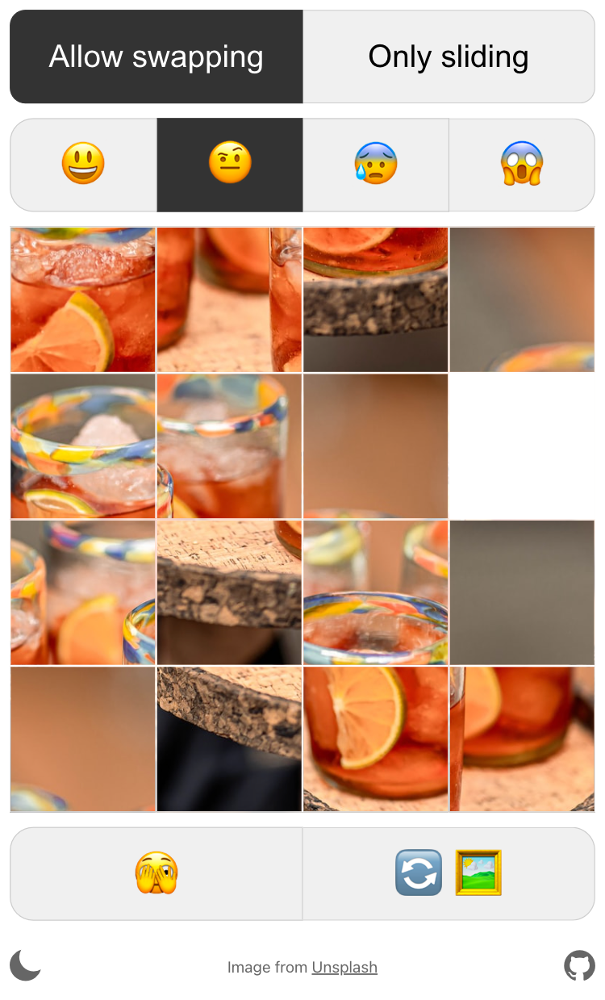

# Tileslide

A simple sliding puzzle game.

## How to play

1. Tap a square to move it to the empty square.
2. Repeat until you've unscrambled the image.
3. There's no step 3!

### Options

-   _Allow swapping_: Any image square can be moved to the empty square. (Easier)
-   _Only sliding_: Only image squares that are directly adjacent to the empty square can be moved. (Harder)
